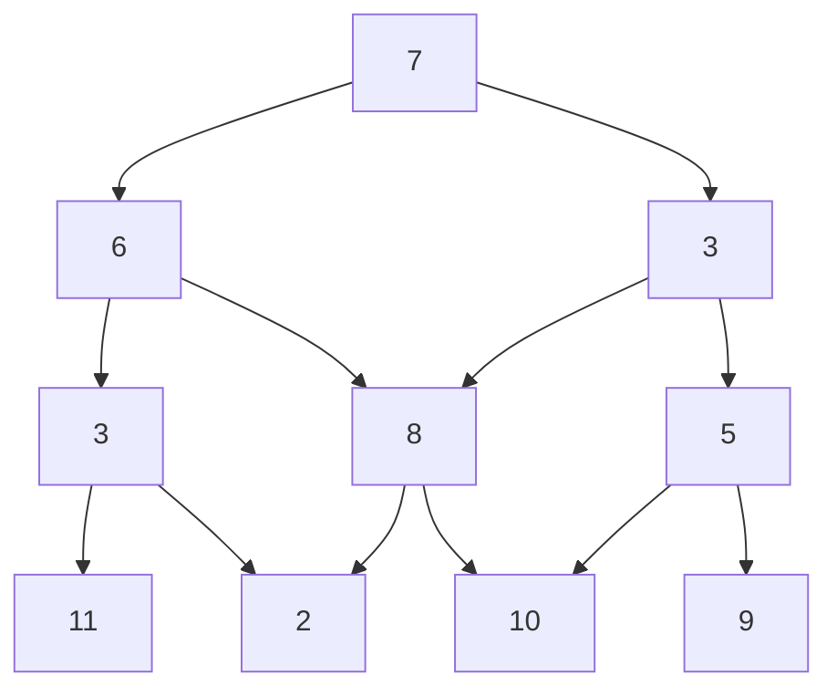

# Minimal path

Given triangular graph like:



represented in a text like

```text
7
6 3
3 8 5
11 2 10 9
```

The program must compute a path with minimum sum of node weights from 
root to lives. Input are text lines from standard input
Expected output:

7 + 6 + 3 + 2 = 18

## Requirement

- Java 17 
- sbt

## Testing

sbt test

## Running 

```shell
$ sbt assembly
$ cat data/data4.txt | java -jar minimal_path.jar
7 + 6 + 3 + 2 = 18
$
```


